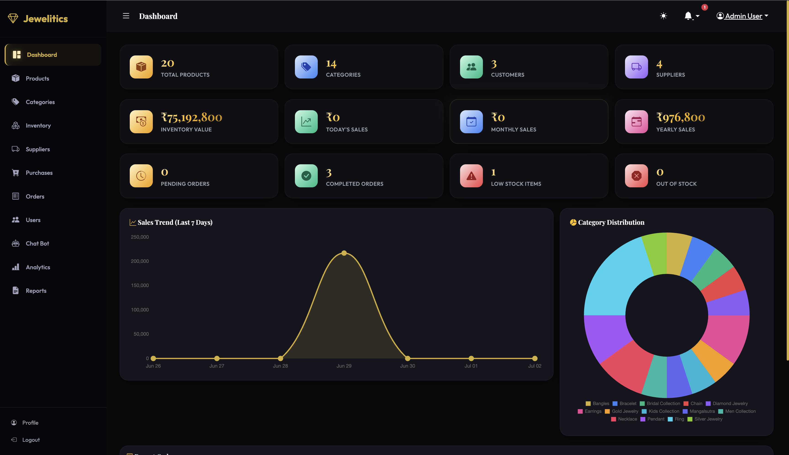
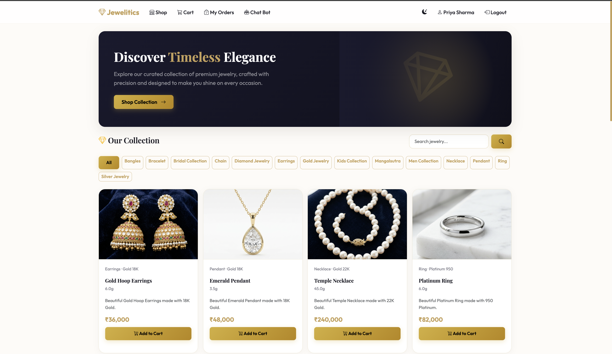
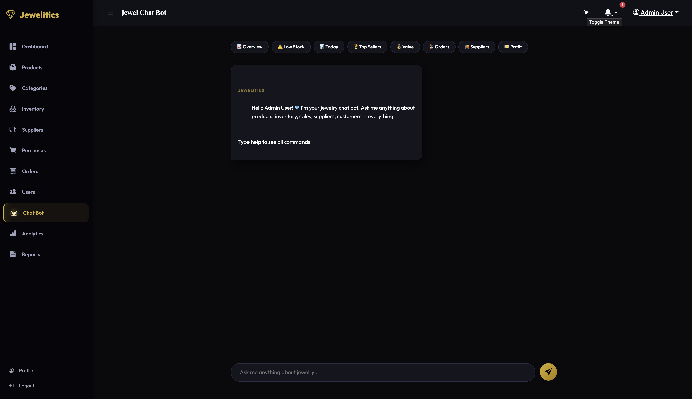
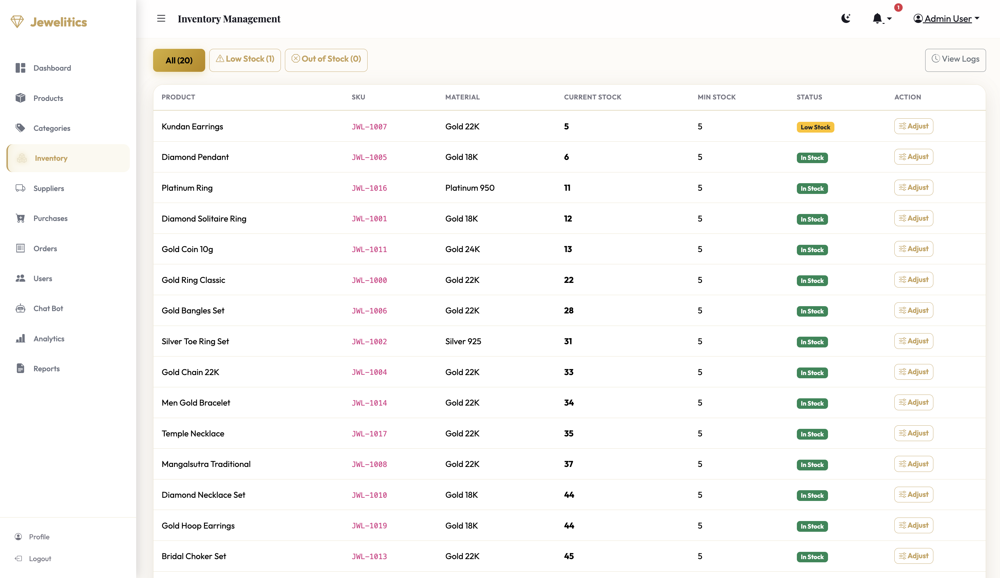
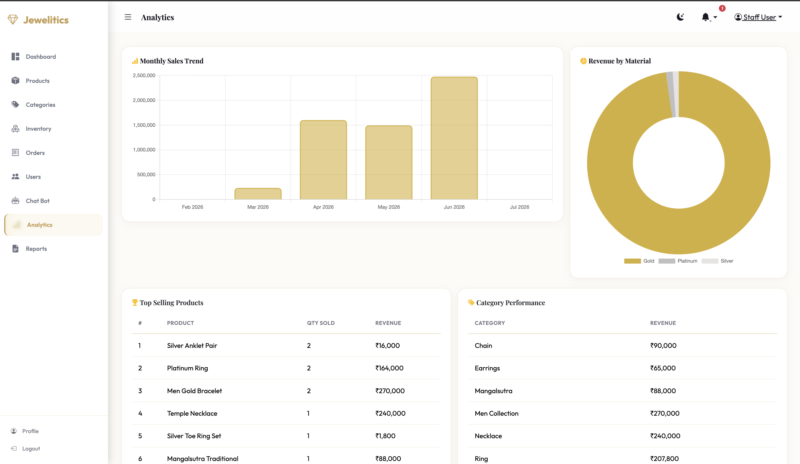

# Jewelitics – Analytics-Driven Jewelry ERP & E-Commerce Platform
A complete luxury jewelry store management system built with **Python Flask** and **SQLite**. This is a **Full Stack + Data Analytics** project featuring role-based authentication, OTP email verification, real-time inventory tracking, a customer shopping portal, order management, advanced SQL sales analytics, and a custom data-driven Chat Bot.


---

## Screenshots

*(Add your screenshots to the `screenshots/` folder to display them here)*

| Admin Dashboard | Customer Shop |
| :---: | :---: |
|  |  |
| **Chat Bot** | **Inventory Management** |
|  |  |
| **Login Page** | **Register Page (Dark Mode)** |
|  |  |
| **Staff Analytics** | **Reports** |
|  |  |
---
## Features

### 🔐 Authentication & Roles
- Secure Login / Register / Logout / Profile Management
- **OTP Email Verification** for new user registrations
- Three roles: **Admin**, **Staff**, **Customer**
- Role-based access control (decorators) to restrict page access
- Secure password hashing (Werkzeug)    

### 📊 Dashboard & Analytics (Data Analytics)
- 12 real-time stat cards (products, sales, stock alerts, orders)
- Interactive Chart.js charts (monthly sales trend, material distribution)
- **Profit Margin Tracker:** Dynamically calculates `(selling_price - purchase_price)` using SQLAlchemy.
- **Dead Stock Detection:** Identifies unsold inventory using SQL Outer Joins.
- Automated CSV report generation for Inventory, Sales, Orders, and Customers.

### 🤖 Custom Chat Bot
- Data-driven Chat Bot providing instant business insights and customer support.
- Fully offline, rule-based logic that queries the SQLite database directly (no external APIs).
- Different commands based on user role (Admin sees profit, Customer sees orders).

### 📦 Product & Inventory Management
- Full CRUD for Products and Categories with image uploading.
- Auto-generated SKUs and stock status badges (In Stock / Low / Out of Stock).
- Real-time stock tracking with adjustment logs (adjust, return, damage, lost).

### 🚚 Supplier & Order Management
- Supplier CRUD and Purchase Order creation (auto stock increase upon receiving).
- Complete customer shopping cart and checkout flow.
- Admin order status flow: Pending → Accepted → Processing → Packed → Shipped → Delivered.
- Order cancellation with automatic stock restoration.

### 🎨 Premium UI/UX
- Luxury jewelry theme (White / Gold / Black).
- Glassmorphism effects and smooth micro-animations.
- **Dark mode toggle** with persistent local storage.
- Responsive sidebar navigation built with Bootstrap 5.

---

## Tech Stack

| Layer | Technology |
|-------|-----------|
| Backend | Python Flask |
| Database | SQLite (via SQLAlchemy ORM) |
| Auth & Security | Flask-Login, Werkzeug, Flask-Mail (OTP) |
| Templates | Jinja2 |
| Frontend | HTML5, CSS3, Bootstrap 5, Vanilla JavaScript |
| Data Visualization | Chart.js |
| Data Export | Python CSV module |

---

## Project Structure

```
Jewelitics/
├── app.py                     # Flask app factory & configuration
├── seed_data.py               # Demo data generator
├── requirements.txt           # Python dependencies
├── .env.example               # Environment variables template
├── models/                    # SQLAlchemy database models
│   ├── user.py                # User model
│   ├── product.py             # Product + Category
│   ├── inventory.py           # InventoryLog
│   ├── supplier.py            # Supplier + PurchaseOrder
│   ├── order.py               # Order + OrderItem + CartItem
│   └── notification.py        # Notification + SalesSummary
├── routes/                    # Flask Blueprints (Controllers)
│   ├── auth.py                # Auth flow + OTP Verification
│   ├── dashboard.py           # Admin Dashboard KPIs
│   ├── products.py            # Products + Categories CRUD
│   ├── inventory.py           # Stock management
│   ├── suppliers.py           # Suppliers + Purchases
│   ├── orders.py              # Orders + Customer Shop
│   ├── reports.py             # Analytics + CSV Reports
│   └── chat.py                # Chat Bot routes
├── templates/                 # Jinja2 HTML templates
│   ├── base.html              # Base layout
│   ├── layout_admin.html      # Admin sidebar layout
│   ├── layout_customer.html   # Customer navbar layout
│   ├── auth/                  # Login, Register, Profile, OTP
│   ├── chat/                  # Chat Bot interfaces
│   ├── dashboard/             # Dashboard views
│   ├── inventory/             # Stock views
│   ├── orders/                # Shop, Cart, Checkout, Order Tracking
│   ├── products/              # Product management views
│   ├── reports/               # Analytics graphs & report lists
│   └── suppliers/             # Supplier management views
├── static/
│   ├── css/style.css          # Complete custom design system
│   └── js/app.js              # Dark mode logic & utilities
└── ml/                        
    └── chatbot.py             # Core rule-based chatbot logic
```

---

## Installation

### 1. Clone or Download
```bash
git clone <your-repository-url>
cd Jewelitics
```

### 2. Create Virtual Environment
```bash
python3 -m venv venv
source venv/bin/activate   # Mac/Linux
venv\Scripts\activate      # Windows
```

### 3. Install Dependencies
```bash
pip install -r requirements.txt
```

### 4. Setup Environment Variables
Create a `.env` file in the root directory and copy the contents from `.env.example`. 

**How to get your Gmail App Password for OTP Verification:**
1. Go to your Google Account Settings -> **Security**.
2. Ensure **2-Step Verification** is turned ON.
3. Search for **App Passwords** in the settings search bar.
4. Create a new App Password (name it "Jewelitics" or similar).
5. Copy the 16-character password and paste it into your `.env` file as `MAIL_PASSWORD=your_16_char_password` (no spaces).
6. Set `MAIL_USERNAME` and `MAIL_DEFAULT_SENDER` to your actual Gmail address.

### 5. Seed Demo Data
```bash
python seed_data.py
```
*(This will wipe the existing DB and create a fresh one with 20+ products, categories, suppliers, and 90 days of sample sales data.)*

### 6. Run the App
```bash
python app.py
```

Open **http://127.0.0.1:5001** in your browser.

---

## Default Login Credentials (Generated by seed_data.py)

| Role | Username | Password |
|------|----------|----------|
| Admin | `admin` | `admin123` |
| Staff | `staff` | `staff123` |
| Customer | `customer` | `customer123` |

---

## Database Schema

11 tables: `users`, `categories`, `products`, `inventory_logs`, `suppliers`, `purchase_orders`, `orders`, `order_items`, `cart_items`, `notifications`, `sales_summary`

---

## License

This project was built for educational purposes and portfolio building.
